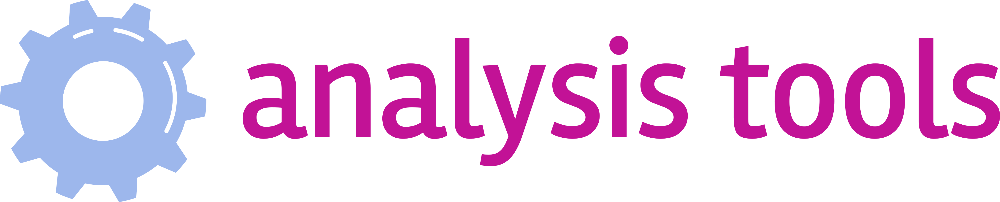

  <a href="http://analysis-tools.dev/">
    
  </a>


This is the main website code of <a href="https://analysis-tools.dev">analysis-tools.dev</a>.  
It is a community-organized project around static and dynamic analysis tools.  
You can help make this website better!

## :heart: Sponsors

This project would not be possible without the generous support of our sponsors.

<table>
  <tr>
    <td><a href="https://deepcode.ai"></a></td>
    <td><a href="https://codescene.io/"></a></td>
    <td><a href="https://r2c.dev/"></a></td>
    <td><a href="https://codiga.io/"></a></td>
  </tr>
</table>

If you also want to support this project, head over to our [Github sponsors page](https://github.com/sponsors/analysis-tools-dev).

## 🚀 Contributing

Thanks for considering to contribute to this project. Here's how to get started:

1. **Clone the repo**

```shell
git clone git@github.com:analysis-tools-dev/website.git
cd website/
```

1. **Install the dependencies**

```
npm install
```

3. **Start developing.**

Navigate into your new site’s directory and start it up.

```shell
npm run dev
```

4. **Open the source code and start editing!**

Your site is now running at http://localhost:3000!

5.  **Send us a pull request**

Once you're happy with your changes, please send us a pull request and we'll review it promptly.
Don't be afraid to make small changes or ask for feedback early. We're happy to help!

## Important Links

-   [Figma Designs](https://www.figma.com/proto/wXX0s5RS2aNQK1waXawRAq)
